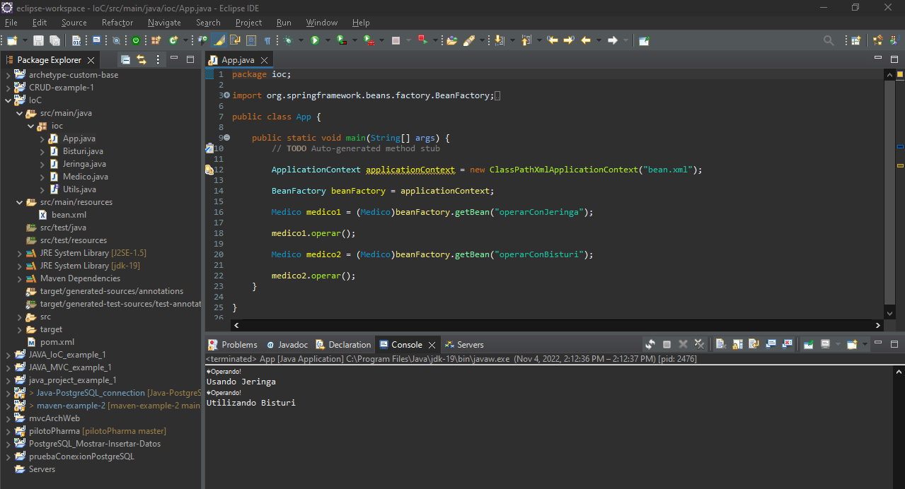

# Ejemplo de Inyección de Dependencias Bean en un proyecto Maven (spring core y spring context support)

# 0. Crear un proyecto maven skipeando el selector de archetypes (quickstart)

# 1. pom.xml

```xml
<project xmlns="http://maven.apache.org/POM/4.0.0" xmlns:xsi="http://www.w3.org/2001/XMLSchema-instance" xsi:schemaLocation="http://maven.apache.org/POM/4.0.0 https://maven.apache.org/xsd/maven-4.0.0.xsd">
  
  	<modelVersion>4.0.0</modelVersion>
  	<groupId>com.app.ioc</groupId>
  	<artifactId>IoC</artifactId>
  	<version>0.0.1-SNAPSHOT</version>

	<dependencies>
		<dependency>
		    <groupId>org.springframework</groupId>
		    <artifactId>spring-core</artifactId>
		    <version>5.3.23</version>
		</dependency>

		<dependency>
		    <groupId>org.springframework</groupId>
		    <artifactId>spring-context-support</artifactId>
		    <version>5.3.23</version>
		</dependency>
	</dependencies>
</project>
```

**Recuerda**: hacer *run as --> maven install* para instalar estas dependencias que hemos definido en el pom.xml

# 2. Utils.java (interface)

```java
package ioc;

public interface Utils {

	public void usar();
}
```

# 3. Bisturi.java

```java
package ioc;

public class Bisturi implements Utils {

	public void usar() {
		System.out.println("Utilizando Bisturi");
	}

}
```

# 4. Jeringa.java

```java
package ioc;

public class Jeringa implements Utils {

	public void usar() {
		System.out.println("Usando Jeringa");
	}

}
```

# 5. Medico.java

```java
package ioc;

public class Medico {

	Utils util;
	
	public void setUtil(Utils util) {
		this.util = util;
	}
	
	public void operar() {
		System.out.println("¡Operando!");
		util.usar();
	}
}
```

# 6. App.java (main)

```java
package ioc;

import org.springframework.beans.factory.BeanFactory;
import org.springframework.context.ApplicationContext;
import org.springframework.context.support.ClassPathXmlApplicationContext;

public class App {

	public static void main(String[] args) {
		// TODO Auto-generated method stub

		ApplicationContext applicationContext = new ClassPathXmlApplicationContext("bean.xml");
		
		BeanFactory beanFactory = applicationContext;
		
		Medico medico1 = (Medico)beanFactory.getBean("operarConJeringa");
		
		medico1.operar();
		
		Medico medico2 = (Medico)beanFactory.getBean("operarConBisturi");
		
		medico2.operar();
	}

}
```

# 7. Ejecución del programa

